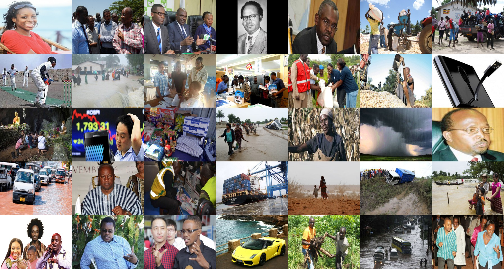
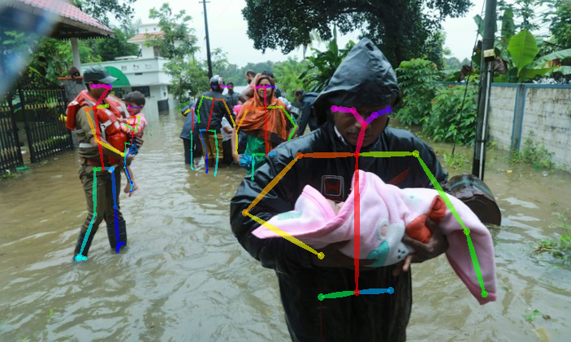
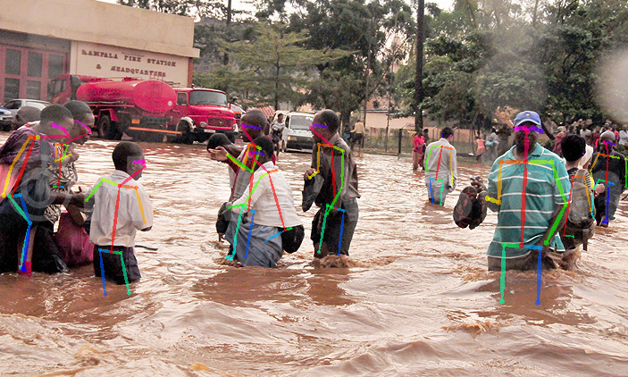
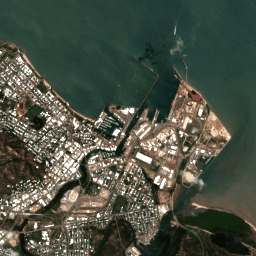
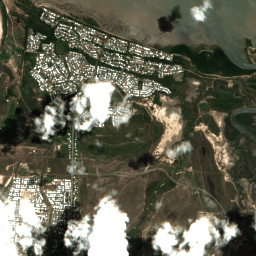
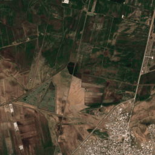
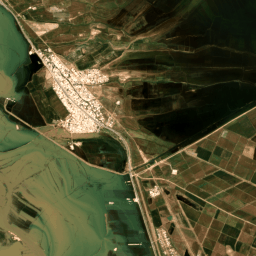

# 2019-Multimedia-Satellite-Task

## What is this task about?

The main objective of the Multimedia Satellite Task is to extract complementary information associated with events which are present in Satellite Imagery and Social Media. Due to their high socio-economic impact, we built upon the last two year's of Multimedia Satellite and continue to focus on flooding events. The task moves forward the state-of-the-art in flood impact assessment by concentrating on aspects that are important but are not generally studied by multimedia researchers. The main objective of this year's task is to quantify <b>severity of flooding events</b> from news articles and satellite imagery. The task involves the following three subtasks:

<h3 align="left">News Image Topic Disambiguation</h3>

Participants receive links to a set of images that appeared in online news articles (English). They are asked to build a binary image classifier that predicts whether or not the topic of the article in which each image appeared was a water-related natural-disaster event. All of the news articles in the data set contain a flood-related keyword, e.g., ´´flood'', but their topics are ambiguous. For example, a news article might mention a ´´flood of flowers'', without being an article on the topic of a natural-disaster flooding event.

<table style="border-width:0;">
<tbody style="width:100%">
<tr>
<td align="center">
 </td>
</tr>
</tbody>
</table>
<i>Figure 1. Sample images extracted from articles of our dataset. The goal of this task is to classify in two classes whether they belong to a flooding event or not.</i>

<h3 align="left">Multimodal Flood Level Estimation</h3>

In the second subtask, participants receive a set of links to online news articles (English) and the accompanying images. The set has been filtered to include only news articles for which the accompanying image depicts a flooding event. Participants are asked to build a binary classifier that predicts whether or not the image contains at least one person standing in water above the knee. Participants can use image-features only, but the task encourages a combination of image and text features, and even use of satellite imagery.
 

<table style="border-width:0;">
<tbody style="width:100%">
<tr>
<td align="center">
 </td>
<td align="center">
</td>
</tr>
</tbody>
</table>
<i>Figure 2. Sample flood-event related images from articles of our dataset. The goal of this task is to classify images based on text and visual information whether there are people standing in water that is above knee level.</i>

<h3 align="left">City-centered satellite sequences</h3>

In this complementary subtask, participants receive a set of sequences of satellite images that depict a certain city over a certain length of time. They are required to create a binary classifier that determines whether or not there was a flooding event ongoing in that city at that time. Because this is the first year we work with sequences of satellite images, the data will be balanced so that the prior probability of the image sequence depicting a flooding event is 50%. This design decision will allow us to better understand the task. Challenges of the task include cloud cover, and ground-level changes with non-flood causes.

<table style="border-width:0;">
<tbody style="width:100%">
<tr>
<td align="center"> 
 </td>
<td align="center"> 
</td>
<td align="center"> 
 </td>
<td align="center"> 
 </td>
</tr>
</tbody>
</table>

<i>Figure 3. Sample image sequences for different cities from our dataset. The goal of this subtask is to classifiy image sequences into two classes whether they belong to a flooding event or not.</i>

## What are important dates for Task-Participation?

<table>
<tbody>
<tr>
<td align="left">May 15, 2019</td>
<td align="left">Development data release</td>
</tr>
<tr>
<td align="left">May 30, 2019</td>
<td align="left">Test data release</td>
</tr>
<tr>
<td align="left">September 20, 2019</td>
<td align="left">Run submission due</td>
</tr>
<tr>
<td align="left">September 23, 2019</td>
<td align="left">Results returned to the participants</td>
</tr>
<tr>
<td align="left">September 30, 2019</td>
<td align="left">Working notes paper submission deadline</td>
</tr>
<tr>
<td align="left">October 27-29, 2019</td>
<td align="left">MediaEval Workshop, Nice, France</td>
</tr>
</tbody>
</table>

## Who are the task organizers?
* Benjamin Bischke, German Research Center for Artificial Intelligence (DFKI) & TUK, Germany
* Patrick Helber, German Research Center for Artificial Intelligence (DFKI) & TUK, Germany
* Erkan Basar, Radboud University & FloodTags, Netherlands, 
* Simon Brugman, Radboud University, Netherlands
* Zhengyu Zhao, Radboud University, Netherlands
* Konstantin Pogorelov, Simula Research Laboratory, Norway

## Task auxiliaries
* Martha Larson, Radboud University, Netherlands
* Jens de Bruijn, Floodtags, Netherlands
* Tom Brouwer, Floodtags, Netherlands
* Rabiul Islam Jony, Queensland University of Technology (QUT), Australia

## Where to get more information?
Detailed information on the task including description of the data, provided features, run submission, etc. can be found on the [task wiki](https://github.com/multimediaeval/2019-Multimedia-Satellite-Task/wiki) (<i>Note: You require access to the repository</i>).
If you need help or have any questions please contact Benjamin Bischke (firstname.lastname at dfki.de).

## What are recommended readings and task references?

1. Bischke, Benjamin, et al. "[Contextual enrichment of remote-sensed events with social media streams.](https://www.dfki.de/fileadmin/user_upload/import/8765_2964284.2984063_socialsatellite_cameraready.pdf)" Proceedings of the 2016 ACM on Multimedia Conference. ACM, 2016.

2. Chaouch, Naira, et al. "[A synergetic use of satellite imagery from SAR and optical sensors to improve coastal flood mapping in the Gulf of Mexico.](https://www.researchgate.net/publication/227694697_A_synergetic_use_of_satellite_imagery_from_SAR_and_optical_sensors_to_improve_coastal_flood_mapping_in_the_Gulf_of_Mexico)" Hydrological Processes 26.11 (2012): 1617-1628.

3. Klemas, Victor. "[Remote sensing of floods and flood-prone areas: an overview.](http://www.bioone.org/doi/10.2112/JCOASTRES-D-14-00160.1)" Journal of Coastal Research 31.4 (2014): 1005-1013.

4. Lagerstrom, Ryan, et al. "[Image classification to support emergency situation awareness.](http://eprints.qut.edu.au/98961/)" Frontiers in Robotics and AI 3 (2016): 54.

5. Ogashawara, Igor, Marcelo Pedroso Curtarelli, and Celso M. Ferreira. "[The use of optical remote sensing for mapping flooded areas.](http://www.ijera.com/papers/Vol3_issue5/LL3519561960.pdf)" International Journal of Engineering Research and Application 3.5 (2013): 1-5. 

6. Peters, Robin, and J. P. D. Albuquerque. "[Investigating images as indicators for relevant social media messages in disaster management.](http://iscram2015.uia.no/wp-content/uploads/2015/05/8-4.pdf)" The 12th International Conference on Information Systems for Crisis Response and Management. 2015.

7. [Planet Team](http://www.planet.com) (2017). Planet Application Program Interface: In Space for Life on Earth. San Francisco, CA. 

8. Schnebele, Emily, et al. "[Real time estimation of the Calgary floods using limited remote sensing data.](http://www.mdpi.com/2073-4441/6/2/381)" Water 6.2 (2014): 381-398.

9. Ticehurst, C. J., P. Dyce, and J. P. Guerschman. "[Using passive microwave and optical remote sensing to monitor flood inundation in support of hydrologic modelling.](http://www.mssanz.org.au/modsim09/I10/ticehurst_I10.pdf)" Interfacing modelling and simulation with mathematical and computational sciences, 18th World IMACS/MODSIM Congress. 2009.

10. Wedderburn-Bisshop, Gerard, et al. "[Methodology for mapping change in woody landcover over Queensland from 1999 to 2001 using Landsat ETM+.](http://citeseerx.ist.psu.edu/viewdoc/download?doi=10.1.1.118.8447&rep=rep1&type=pdf)" Department of Natural Resources and Mines, 2002.

11. Woodley, Alan, et al. "[Introducing the Sky and the Social Eye.](http://ceur-ws.org/Vol-1739/MediaEval_2016_paper_9.pdf)" Working Notes Proceedings of the MediaEval 2016 Workshop. Vol. 1739. CEUR Workshop Proceedings, 2016. 

12. Yang, Yimin, et al. "[Hierarchical disaster image classification for situation report enhancement.](https://users.cs.fiu.edu/~chens/PDF/IRI11_Disaster.pdf)" Information Reuse and Integration (IRI), 2011 IEEE International Conference on. IEEE, 2011.

 
 

<table align="center" style="margin: 0px auto;">
<tbody>
<tr style="border-width:0;">
<td align="center"> 
</td>
<td align="center"> 
</td>
<td align="center"> 
</td>
<td align="center"> 
 </td>
</tr>
</tbody>
</table>

